# 🚀 Fullstack Web-Based Task Management System (Kanban)

## 📌 Project Description

This project is a **fullstack web-based task management system** designed to support **team collaboration** and **project organization**.

The system provides a **visual and intuitive interface** that allows users to manage tasks efficiently using a **Kanban-style board**. It helps teams:

* Organize workflows
* Assign responsibilities
* Track progress

The goal is to simulate a **real-world productivity platform** (similar to Trello/Jira) while demonstrating **fullstack development skills using JavaScript technologies**.

---

## 🎯 Project Objectives

* Develop a fullstack web application using modern JavaScript technologies
* Implement secure authentication and authorization
* Build workspace-based collaboration features
* Design an intuitive Kanban task tracking system
* Apply RESTful APIs and scalable architecture

---

## 🛠️ Technologies Used

### Frontend

* React.js
* JavaScript

### Backend

* Node.js
* Express.js

### Database

* PostgreSQL

### Authentication & Security

* bcrypt / bcryptjs
* JSON Web Token (JWT)

### Backend Utilities

* cors
* dotenv

### Database Libraries

* pg

### Development Tools

* nodemon
* DBeaver

---

## 🏗️ System Architecture

The system follows a **Client–Server architecture**:

* Frontend (**React**) → Handles UI & user interactions
* Backend (**Node.js + Express**) → Handles business logic
* Database (**PostgreSQL**) → Stores data
* Communication → RESTful APIs

---

## ✨ Features

### 🔐 Authentication

* User registration & login
* Password hashing with bcrypt
* JWT-based authentication
* Cookie-based session handling

### 👥 Workspace Management

* Create / update / delete workspaces
* Invite & remove members
* Role-based access control

### 📁 Project Management

* Create / update / delete projects
* Organize projects within workspaces

### 📊 Kanban Board

* Create and manage columns
* Drag & drop tasks
* Reorder tasks
* Visual workflow tracking

### ✅ Task Management

* CRUD tasks
* Assign tasks
* Track status via columns

### 🔑 Authorization

* Role-based permissions per workspace

---

## 🚧 Planned Features (Future)

* Task comments
* File attachments
* Labels / tags
* Notifications
* Real-time updates (WebSocket)
* Calendar / timeline view

---

## 👤 User Roles

### Guest

* View public content

### Registered User

* Manage workspaces, projects, tasks
* Collaborate with team

### Admin (Workspace Owner)

* Manage members & permissions
* Control workspace settings

---

## ⚙️ Installation & Setup

### 1️⃣ Backend Setup

```bash
cd backend
npm install
```

### 2️⃣ Environment Variables

```env
DB_USER=postgres
DB_PASSWORD=yourpassword
DB_HOST=localhost
DB_PORT=5432
DB_NAME=yourdbname

JWT_SECRET=yoursecretkey
JWT_REFRESH_SECRET=yoursecretkey
```

### 3️⃣ Run Backend

```bash
npm run dev
```

👉 Backend: http://localhost:5000

---

### 4️⃣ Frontend Setup

```bash
cd frontend
npm install
npm run dev
```

👉 Frontend: http://localhost:3000

---

## ▶️ Running the Project

1. Start PostgreSQL
2. Run backend server
3. Run frontend
4. Open: http://localhost:3000

---

## 📂 Project Structure

```
backend/
 └── src/
     ├── config
     ├── controllers
     ├── middleware
     ├── models
     ├── routers
     ├── services
     └── utils

frontend/
 └── src/
     ├── api
     ├── components
     ├── pages
     ├── services
     └── utils
```

---

## 🔌 API Overview

### Authentication APIs

| Endpoint           | Method | Description   |
| ------------------ | ------ | ------------- |
| /api/auth/register | POST   | Register user |
| /api/auth/login    | POST   | Login         |
| /api/auth/user     | GET    | Get user info |

---

### Workspace APIs

| Endpoint                    | Method     |
| --------------------------- | ---------- |
| /api/workspaces             | GET/POST   |
| /api/workspaces/:id         | GET/DELETE |
| /api/workspaces/:id/members | POST       |

---

### Project APIs

| Endpoint          | Method         |
| ----------------- | -------------- |
| /api/projects     | GET/POST       |
| /api/projects/:id | GET/PUT/DELETE |

---

### Task APIs

| Endpoint       | Method     |
| -------------- | ---------- |
| /api/tasks     | GET/POST   |
| /api/tasks/:id | PUT/DELETE |

---

## 📸 Screenshots

> Add images like this:

## 📸 Screenshots

### 🔐 Login Page
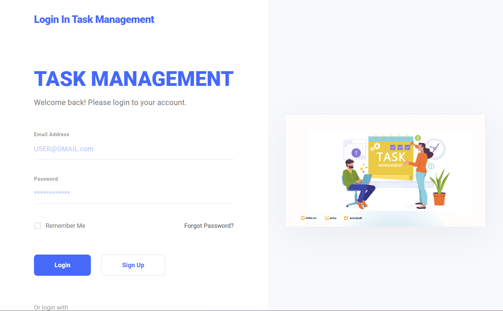

### 📝 Register Page
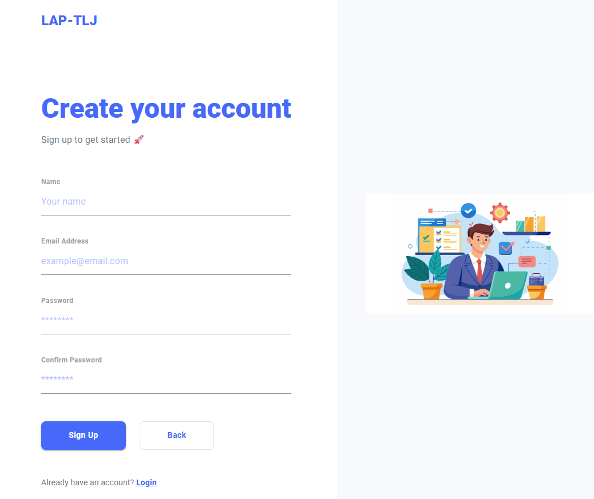

### 🏠 Workspace Dashboard


### ➕ Create Workspace
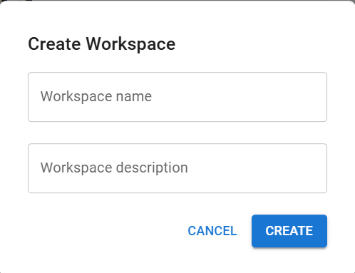

### 👥 Invite Member
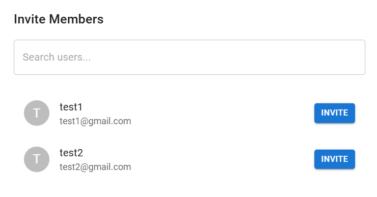

### 📊 Dashboard
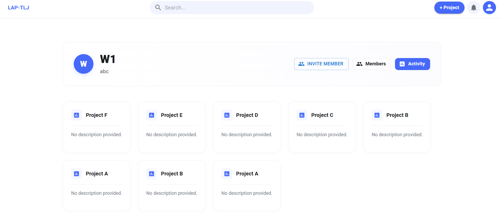

### 📌 Project Board
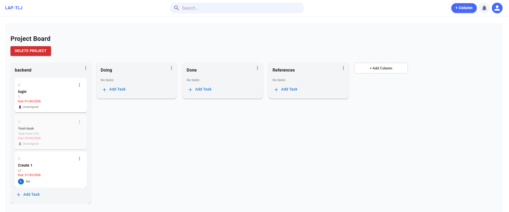

### ➕ Create Task
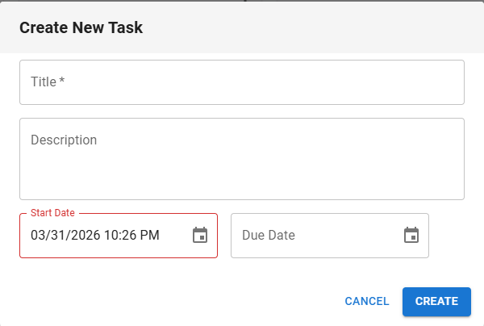

### ✏️ Edit Task
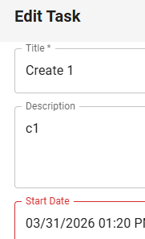

### 👤 Assign Task
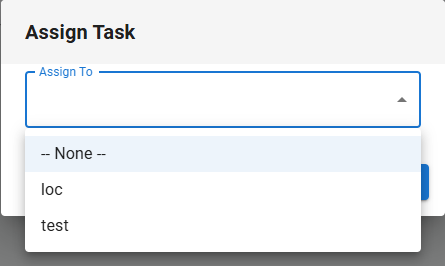

### 🧱 Edit Column
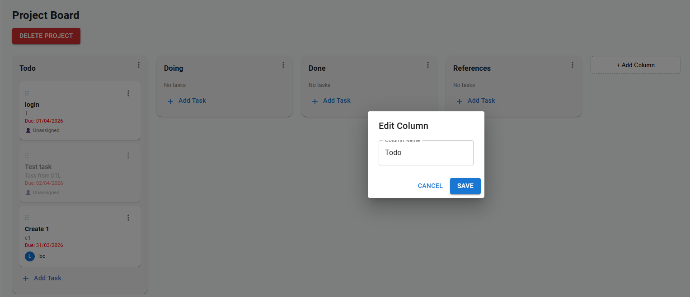

### 🔄 Update Status
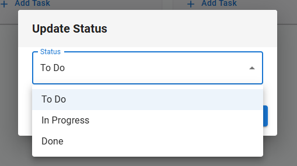

### ➕ Create Column


### 👤 Update Profile
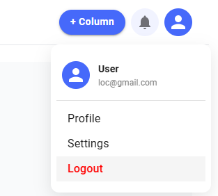

## 👨‍💻 Team Members

| No | Name            | Role     |
| -- | --------------- | -------- |
| 1  | Phạm Viết Phước | Database |
| 2  | Đỗ Thành Lộc    | Backend  |
| 3  | Lê Tuấn Anh     | Frontend |

---

## 🎓 Project Purpose

This project was developed to demonstrate:

* Fullstack development skills
* System design & architecture
* Real-world application structure

It also serves as a **portfolio project**.

---

## 🔮 Future Improvements

* WebSocket real-time updates
* Notification system
* UI/UX improvements
* Advanced task dependency system

---

## 📌 Notes

* Ensure PostgreSQL is running
* Configure environment variables correctly
* Some features are under development

---

## 📚 References

* React.js Docs
* Node.js & Express Docs
* PostgreSQL Docs
* JWT Authentication Guide
